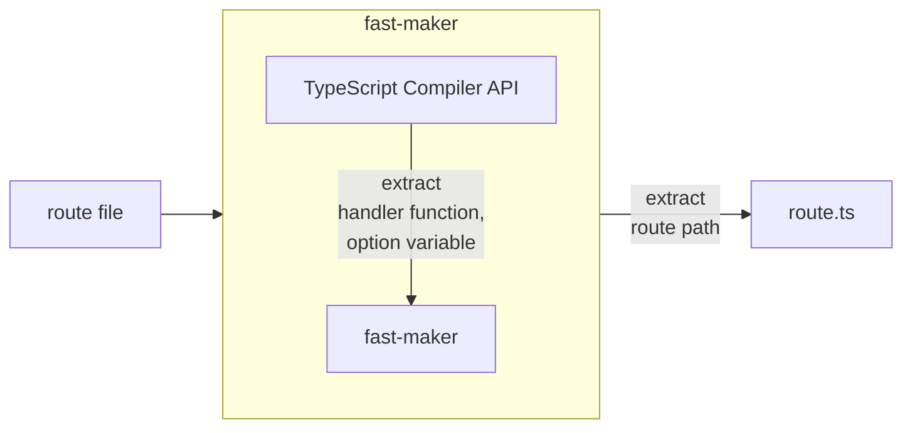

# fast-maker


[](https://npmcharts.com/compare/fast-maker?minimal=true)
[](https://github.com/imjuni/fast-maker)
[](https://github.com/imjuni/fast-maker/issues)
[](https://www.npmjs.com/package/fast-maker)
[](https://github.com/imjuni/fast-maker/blob/master/LICENSE)
[](https://github.com/imjuni/fast-maker/actions/workflows/ci.yml)
[](https://codecov.io/gh/imjuni/fast-maker)
[](https://github.com/prettier/prettier)

`fast-maker` generate fastify.js route configuration using by directory structure.

Why `fast-maker`?

fastify.js already have auto route mechanics using [fastify-autoload](https://github.com/fastify/fastify-autoload). But why you have to use `fast-maker`?

1. [Static analysis](https://en.wikipedia.org/wiki/Static_program_analysis): `fast-maker` generate TypeScript source code. Because it help to find error in compile-time, not runtime
2. Complex Variable: You can use like that: `/person/[kind]-[id]/`. It help to get id and kind of id, for example serial-number and id or db-pk and id
3. Next.js: `fast-maker` use the same mechanics as [Next.js](https://nextjs.org/docs/routing/introduction)
4. `fast-maker` support a beautiful cli-interface

## Table of Contents <!-- omit in toc -->

- [Getting started](#getting-started)
- [How it works?](#how-it-works)
- [Installation](#installation)
- [Usage](#usage)
- [Routing](#routing)
  - [HTTP Method](#http-method)
  - [Route options](#route-options)
  - [Route handler](#route-handler)
  - [Variable in Route Path](#variable-in-route-path)
- [Example using fastify.js](#example-using-fastifyjs)
- [Relate To](#relate-to)
- [Roadmaps](#roadmaps)
- [License](#license)

## Getting started

```bash
npx fast-maker init
npx fast-maker route
```

You can create configuration file using init command. And you can run route command, `fast-maker` generate `route.ts` file on your output directory in configuration file.

You can see this mechanics!


## How it works?

`fast-maker` using **TypeScript Compiler API**. So `fast-maker` exactly know handler function and route option in each file.



The image below briefly shows how the directory is converted to route configurations.

| AS-IS (directory structure)                                |     | TO-BE (route function)                             |
| ---------------------------------------------------------- | --- | -------------------------------------------------- |
|  | ➜   |  |

## Installation

```basn
npm i fast-maker --save-dev
```

## Usage

You can see help from `--help` option.

```bash
# display help for each commands
npx fast-maker --help

# display help for route commands
npx fast-maker route --help

# display help for watch commands
npx fast-maker watch --help

# display help for init commands
npx fast-maker init --help
```

Also you can see detail option [here](/docs/options.md).

## Routing

`fast-maker` has a file-system based route configuration. This concept borrowed from [Next.js routing system](https://nextjs.org/docs/routing/introduction). But one difference is that _HTTP Method_ is separated by file-system.

### HTTP Method

use file-system.

```text
handlers/
├─ get/
│  ├─ hero/
│  │  ├─ [name].ts
├─ post/
│  ├─ hero.ts
├─ put/
│  ├─ hero/
│  │  ├─ [name].ts
├─ delete/
│  ├─ hero/
│  │  ├─ [name].ts
```

`get`, `post`, `put`, `delete` directory represent _HTTP Method_. Also you can use `options`, `patch`, `head`, `all` directory.

### Route options

You can pass `RouteShorthandOptions` option like that,

```ts
export const option: RouteShorthandOptions = {
  schema: {
    querystring: schema.properties?.Querystring,
    body: schema.properties?.Body,
  },
};
```

You have to `named export` and variable name must be a `option`.

### Route handler

You can pass route handler function like that,

```ts
import { FastifyRequest } from 'fastify';
import type { IReqSearchPokemonQuerystring, IReqSearchPokemonParams } from '../../interface/IReqSearchPokemon';

export default async function (
  req: FastifyRequest<{ Querystring: IReqSearchPokemonQuerystring; Params: IReqSearchPokemonParams }>,
) {
  console.debug(req.query);
  console.debug(req.body);

  return 'hello';
}
```

You have to `non-named export` (aka default export). Also you can use arrow function and you can use any name under TypeScript function name rule, as well as type arguments perfectly applied on route configuration

### Variable in Route Path

File or Directory name surrounded square bracket like that,

```text
handlers/
├─ get/
│  ├─ hero/
│  │  ├─ [name].ts
```

Complex variable, No problem.

```text
handlers/
├─ get/
│  ├─ hero/
│  │  ├─ [affiliation]-[name].ts
```

This route path access like that: `curl http://localhost:8080/hero/marvel-ironman`

That's it. `fast-maker` takes care of the rest.

## Example using fastify.js

A complete example of using `fast-maker` can be found at [Ma-eum](https://github.com/maeumjs/maeum).

## Relate To

- [ts-morph](https://github.com/dsherret/ts-morph)
  - TypeScript Compiler API wrapper

## Roadmaps

- [ ] display each route path in cli-table
- [ ] add new option silent
- [ ] documentation site
- [ ] add more test

## License

This software is licensed under the [MIT](https://github.com/imjuni/fast-maker/blob/master/LICENSE).
