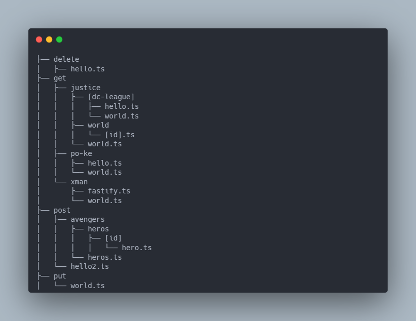
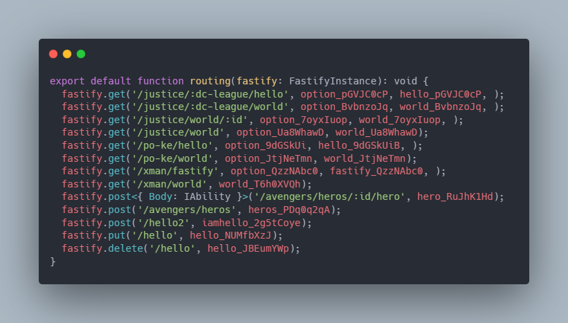

# fast-maker


[](https://npmcharts.com/compare/fast-maker?minimal=true)
[](https://github.com/imjuni/fast-maker)
[](https://github.com/imjuni/fast-maker/issues)
[](https://www.npmjs.com/package/fast-maker)
[](https://github.com/imjuni/fast-maker/blob/master/LICENSE)
[](https://github.com/imjuni/fast-maker/actions/workflows/ci.yml)
[](https://codecov.io/gh/imjuni/fast-maker)
[](https://github.com/prettier/prettier)

`fast-maker` generate fastify.js route configuration using by directory structure.

Why `fast-maker`?

fastify.js already have auto route mechanics using [fastify-autoload](https://github.com/fastify/fastify-autoload). But why you have to use `fast-maker`?

1. [Static analysis](https://en.wikipedia.org/wiki/Static_program_analysis): `fast-maker` generate TypeScript source code. Because it help to find error in compile-time, not runtime
2. Complex Variable: You can use like that: `/person/[kind]-[id]/`. It help to get id and kind of id, for example serial-number and id or db-pk and id
3. Next.js: `fast-maker` use the same mechanics as [Next.js](https://nextjs.org/docs/routing/introduction)
4. `fast-maker` support a beautiful cli-interface

## Table of Contents <!-- omit in toc -->

- [Getting started](#getting-started)
- [Installation](#installation)
- [Usage](#usage)
- [Detail option](#detail-option)
- [Constraints](#constraints)
  - [TypeScript only](#typescript-only)
  - [Directory structure is route path](#directory-structure-is-route-path)
    - [method](#method)
    - [path parameter](#path-parameter)
  - [Single file, Single route](#single-file-single-route)
  - [Hash](#hash)
- [Type declaration for FastifyRequest](#type-declaration-for-fastifyrequest)
- [RouteShorthandOptions](#routeshorthandoptions)
- [.fastmakerrc file](#fastmakerrc-file)

## Getting started

```bash
npx fast-maker -h [your handler directory]
```


| directory structure                                        |     | route function                                     |
| ---------------------------------------------------------- | --- | -------------------------------------------------- |
|  | ➜   |  |

Yes, `fast-maker` automatic generation route function!

## Installation

```basn
npm i fast-maker --save-dev
```

## Usage

fast-maker need two option. handlers directory and tsconfig.json file. Or you can create .fastmakerrc.

```bash
# with option
fast-maker -h <your ruote handler directory>

# with .fastmakerrc
fast-maker -c ./.configs/.fastmakerrc
```

## Detail option

|    name    | required | alias | desc.                                                                                                         |
| :--------: | :------: | :---: | :------------------------------------------------------------------------------------------------------------ |
| --handler  | required |  -a   | API handler directory                                                                                         |
| --project  | required |  -p   | tsconfig path                                                                                                 |
|  --output  |          |  -o   | route.ts file generate on output directory. Default value is route handler directory(--handler option passed) |
| --verbose  |          |  -v   | verbose message display                                                                                       |
| --debugLog |          |  -d   | generate debug log file                                                                                       |
|  --config  |          |  -c   | configuration file load given directory                                                                       |

## Constraints

1. Typescript only
1. Directory structure is route path
1. Single file, Single route
1. Hash

### TypeScript only

fast-maker based on TypeScript type system and use TypeScript compiler API(using ts-morph). Therefore only work on TypeScript project.

### Directory structure is route path

fast-maker inspired by CodeIgniter and Next.js routing system. fast-maker using specific directory name use to method discrimination. So fast-maker need get, post, put, delete, etc directory need to method discrimination.

#### method

get, post, put, delete, all, etc directory bind method

- as-is: \<your project>/src/handlers/get/utility/health_check
- to-be: server.get('/utility/health_check')

- as-is: \<your project>/src/handlers/post/articles
- to-be: server.post('/articles')

#### path parameter

square brackets replace to path parameter

- as-is: \<your project>/src/handlers/get/articles/[id].ts
- to-be: server.get('/articles/:id')

- as-is: \<your project>/src/handlers/get/major/[majorId]/student/[studentId].ts
- to-be: server.get('/major/:majorId/student/:studentId')

### Single file, Single route

fast-maker using default function to handler function. `option` variable use to `RouteShorthandOptions`.

### Hash

For example, option is same name every file. Also route handler can have same filename in many directory. Therefore fast-maker add hash each route handler and option. Like below example.

```ts
import IReqPokeHello from './get/interface/IReqPokeHello';
import hello_bc1Vxcm2acwx2zx33spLFPqxVvROeeVa, {
  option as option_bc1Vxcm2acwx2zx33spLFPqxVvROeeVa,
} from './get/po-ke/hello';

fastify.get<IReqPokeHello>(
  '/po-ke/hello',
  option_bc1Vxcm2acwx2zx33spLFPqxVvROeeVa,
  hello_bc1Vxcm2acwx2zx33spLFPqxVvROeeVa,
);
```

Hash create by resolved full-directory. And hash use crypto.createHmac function. So, if you donot change directory structure that always same string.

## Type declaration for FastifyRequest

fast-maker support FastifyRequest type argument. see below.

```ts
// get/poke/world.ts
const world = async (
  req: FastifyRequest<
    {
      Querystring: IReqPokeHello['Querystring'];
      Body: IReqPokeHello['Body'];
      Headers: {
        'access-token': string;
        'refresh-token': string;
        'expire-time': {
          token: string;
          expire: number;
          site: {
            host: string;
            port: number;
          };
        };
      };
    },
    Server
  >,
  _reply: FastifyReply,
) => {
  console.debug(req.query);
  console.debug(req.body);

  return 'world';
};

// generated code
fastify.get<{
  // if IReqPokeHello interface in your typescript project, fast-maker append postfix hash.
  // Because error prevent raise by same name interface import
  Querystring: IReqPokeHello_052A3A1D6C6D4FFC835C4EB7F39FE90E['Querystring'];
  Body: IReqPokeHello_052A3A1D6C6D4FFC835C4EB7F39FE90E['Body'];
  Headers: {
    'access-token': string;
    'refresh-token': string;
    'expire-time': {
      token: string;
      expire: number;
      site: {
        host: string;
        port: number;
      };
    };
  };
}>('/po-ke/world', option_nPZHxkE1fH4b3EascyCyIFc8UqLca2bc, world_nPZHxkE1fH4b3EascyCyIFc8UqLca2bc);
```

Don't worry about request type arguments, detail type declare and error prevent!

## RouteShorthandOptions

Named export `option` variable use to RouteShorthandOptions. I recommand using [simple-tjscli](https://www.npmjs.com/package/simple-tjscli). or [crate-ts-json-schema](https://github.com/imjuni/create-ts-json-schema). simple-tjscli, create-ts-json-schema can transfile TypeScript interface to JSONSchema. So you can pass like that.

```ts
// simple-tjscli
export const option: RouteShorthandOptions = {
  schema: {
    querystring: schema.properties?.Querystring,
    body: schema.properties?.Body,
  },
};

// create-ts-json-schema
export const option: RouteShorthandOptions = {
  schema: {
    querystring: { $ref: 'your-json-schema-name-of-querystring' },
    body: { $ref: 'your-json-schema-name-of-body' },
  },
};
```

If you using [@fastify/swagger](https://www.npmjs.com/package/@fastify/swagger), JSONSchema will be create swagger.io document.

## .fastmakerrc file

You can use .fastmakerrc file for configuration. fast-maker use jsonc parser for configuration file. See below.

```jsonc
{
  "project": "./server/tsconfig.json",
  "handler": "./server/handlers/api",
  "output": "./server/handlers"
}
```
