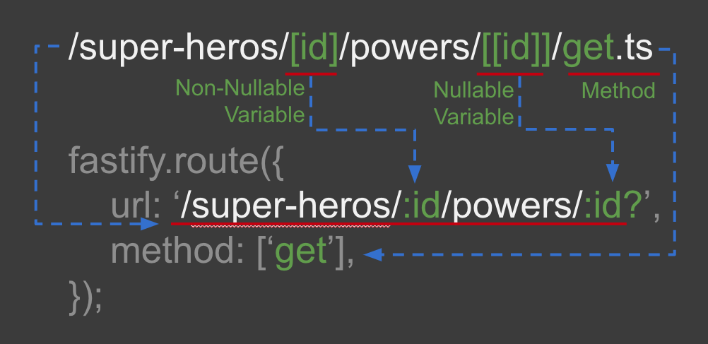

# fast-maker


[](https://npmcharts.com/compare/fast-maker?minimal=true)
[](https://github.com/imjuni/fast-maker)
[](https://github.com/imjuni/fast-maker/issues)
[](https://www.npmjs.com/package/fast-maker)
[](https://github.com/imjuni/fast-maker/blob/master/LICENSE)
[](https://github.com/imjuni/fast-maker/actions/workflows/ci.yml)
[](https://codecov.io/gh/imjuni/fast-maker)
[](https://github.com/prettier/prettier)

`fast-maker` generate [fastify.js](https://github.com/fastify/fastify) route configuration using by directory structure.

Why `fast-maker`?

1. Zeor cost for routing configuration at runtime
2. [Static analysis](https://en.wikipedia.org/wiki/Static_program_analysis): `fast-maker` generates typescript source code, so many errors can be found at compile time
3. flexible routing: supports various routing such as variable joining, regular expressions, etc. for example, `/student/[grade]-[id]`, `/hero/:id/power/:id?`
4. single way: there is only one way to create one routing configuration, so there is no risk of creating routing configurations in different ways even when collaborating
5. less code conflicts: by excluding auto-generated code from the VCS, there is less chance of code conflicts when people collaborate
6. beautiful CLI interface
7. generate a route-map.ts file that summarizes routing information. It can be used for a variety of purposes, including logging. The route-map.ts file is useful because it is generated before run-time

## Table of Contents <!-- omit in toc -->

- [Getting started](#getting-started)
- [How it works?](#how-it-works)
- [Installation](#installation)
- [Usage](#usage)
- [Url building](#url-building)
  - [Parametric](#parametric)
  - [Combined parameter](#combined-parameter)
  - [Regular Expression, Wildcard](#regular-expression-wildcard)
  - [Route options](#route-options)
  - [Route handler](#route-handler)
- [Example using fastify.js](#example-using-fastifyjs)
- [Relate To](#relate-to)
- [Roadmaps](#roadmaps)
- [License](#license)

## Getting started

```bash
npx fast-maker init
npx fast-maker route
```

You can create configuration file using init command. And you can run route command, `fast-maker` generate `route.ts` file on your output directory in configuration file.

You can see this mechanics!


## How it works?

`fast-maker` using **TypeScript Compiler API**. So `fast-maker` exactly know handler function and route option in each file.


The image below briefly shows how the directory is converted to route configurations.

| AS-IS (directory structure)                                |     | TO-BE (route function)                             |
| ---------------------------------------------------------- | --- | -------------------------------------------------- |
|  | ➜   |  |

## Installation

```basn
npm i fast-maker --save-dev
```

## Usage

You can see help from `--help` option.

```bash
# display help for each commands
npx fast-maker --help

# display help for route commands
npx fast-maker route --help

# display help for init commands
npx fast-maker init --help
```

Also you can see detail option [here](/docs/options.md).

## Url building



The figure above shows at a quick look how `fast-maker` generates a route configuration. Routing with a file-system is intuitive and easy to understand, and it also allows many people to collaborate . This concept borrows from [Next.js routing system](https://nextjs.org/docs/routing/introduction). However, I've improved it to determine the http method as the filename.

### Parametric

file-system

```bash
/handlers/example/[userId]/get.ts
```

generated TypeScript code like that,

```ts
// parametric
fastify.route({
  method: ['get'],
  url: '/example/:userId',
  handler: function (request, reply) {
    // curl ${app-url}/example/12345
    // userId === '12345'
    const { userId } = request.params;
    // your code here
  }
});
```

### Combined parameter

file-system

```bash
/handlers/[lat]-[lng]/radius/[[r]]/patch.ts
```

generated TypeScript code like that,

```ts
fastify.route({
  method: ['patch'],
  url: '/example/near/:lat-:lng/radius/:r?',
  handler: function (request, reply) {
    // curl ${app-url}/example/near/15°N-30°E/radius/20
    // lat === "15°N"
    // lng === "30°E"
    // r ==="20"
    const { lat, lng, r } = request.params;
    // your code here
  }
});
```

### Regular Expression, Wildcard

file-system

```bash
/handlers/example/at/[$time]/get.ts
```

replace map in `get.ts`

```ts
// replace map
const map = new Map<string, string>(['$time', ':hour(^\\d{2})h:minute(^\\d{2})m'])
```

generated TypeScript code like that,

```ts
fastify.route({
  method: ['get'],
  url: '/example/at/:hour(^\\d{2})h:minute(^\\d{2})m',
  handler: function (request, reply) {
    // curl ${app-url}/example/at/08h24m
    // hour === "08"
    // minute === "24"
    const { hour, minute } = request.params;
    // your code here
  }
});
```

### Route options

You can pass `RouteShorthandOptions` option like that,

```ts
// When not using a `fastify` instance, you can declare it as a variable like this
export const option: RouteShorthandOptions = {
  schema: {
    querystring: schema.properties?.Querystring,
    body: schema.properties?.Body,
  },
};
```

When using the `fastify` instance, you can declare it as a function like this,

```ts
// completly same, 
// export function option(fastify: FastifyInstance): RouteShorthandOptions { ... }
export const option = (fastify: FastifyInstance): RouteShorthandOptions => {
  return {
    schema: {
      querystring: schema.properties?.Querystring,
      body: schema.properties?.Body,
    },
     preHandler: fastify.auth([
      fastify.allowAnonymous,
      fastify.verifyBearerAuth
    ]),
  };
};
```

You have to `named export` and variable name must be a `option`.

### Route handler

You can pass route handler function like that,

```ts
import { FastifyRequest } from 'fastify';
import type { IReqSearchPokemonQuerystring, IReqSearchPokemonParams } from '../../interface/IReqSearchPokemon';

export async function handler(
  req: FastifyRequest<{ Querystring: IReqSearchPokemonQuerystring; Params: IReqSearchPokemonParams }>,
) {
  console.debug(req.query);
  console.debug(req.body);

  return 'hello';
}
```

You have to `named export` and variable name must be a `handler`. Also you can use arrow function and you can use any name under TypeScript function name rule, as well as type arguments perfectly applied on route configuration

## Example using fastify.js

A complete example of using `fast-maker` can be found at [Ma-eum](https://github.com/maeumjs/maeum-pet-store).

## Relate To

- [ts-morph](https://github.com/dsherret/ts-morph)
  - TypeScript Compiler API wrapper

## Roadmaps

- [x] display each route path in cli-table
- [ ] add new option silent
- [ ] documentation site
- [x] add more test

## License

This software is licensed under the [MIT](https://github.com/imjuni/fast-maker/blob/master/LICENSE).
